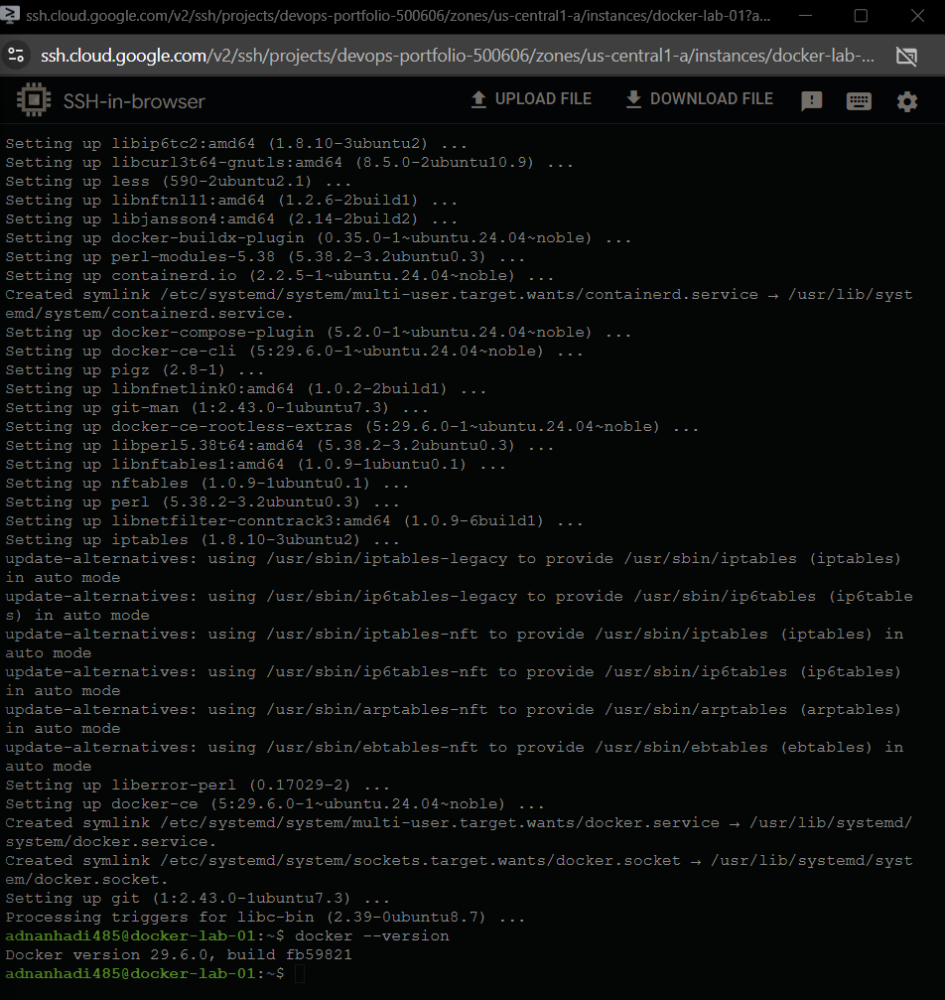
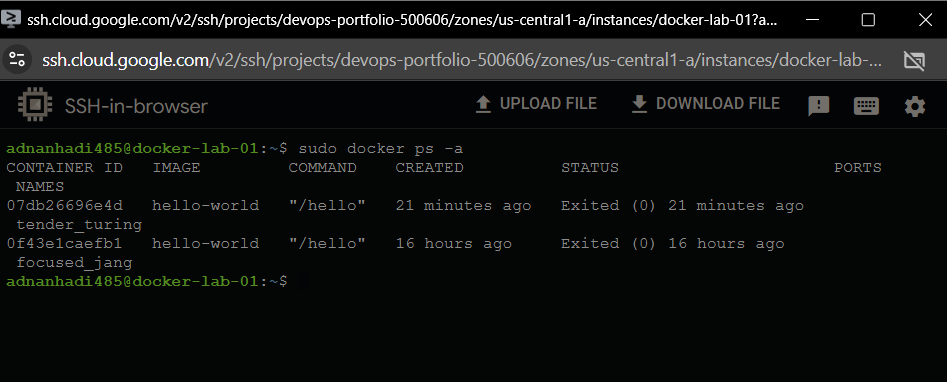
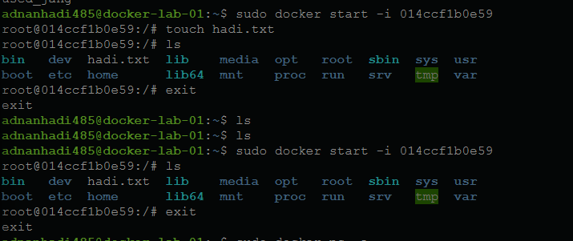
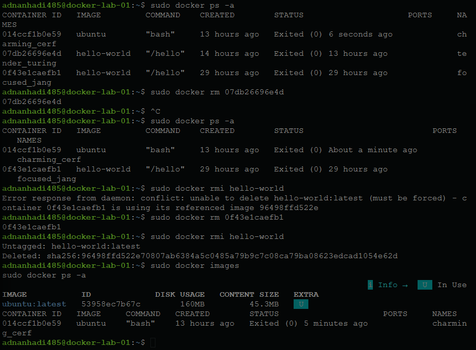

# 🐳 Docker Fundamentals Lab

A hands-on Docker fundamentals project completed on an **Ubuntu 24.04 LTS** virtual machine hosted on **Google Cloud Platform (GCP)**. This project focuses on understanding Docker through practical experimentation, building a strong foundation in images, containers, filesystem isolation, persistence, and resource lifecycle management.

---

# 📖 Project Overview

The objective of this lab was to understand Docker from first principles rather than simply memorizing commands. Every concept was verified through hands-on experiments using the Linux command line to build a practical understanding of Docker's architecture and workflow.

---

# 🎯 Objectives

* Install Docker Engine on Ubuntu
* Verify Docker installation
* Pull images from Docker Hub
* Understand Docker images and containers
* Explore the Docker container lifecycle
* Work with interactive containers
* Understand filesystem isolation
* Verify container persistence
* Learn Docker cleanup and dependency management

---

# 🛠 Technologies Used

* Google Cloud Platform (GCP)
* Ubuntu 24.04 LTS
* Docker Engine
* Linux (Bash)
* Git
* GitHub

---

# 🏗 Docker Architecture

```text
Docker Hub
     │
     ▼
Docker Image
     │
     ▼
Docker Container
     │
     ▼
Isolated Writable Filesystem
```

---

# 💻 Commands Used

```bash
docker --version
docker info
docker images
docker ps
docker ps -a
docker run hello-world
docker run -it ubuntu bash
docker start -i
docker logs
docker inspect
docker rm
docker rmi
```

---

# 🚀 Lab Walkthrough

### 1. Provisioned an Ubuntu Virtual Machine

Created an Ubuntu virtual machine on Google Cloud Platform to serve as the Docker host.

---

### 2. Installed Docker Engine

Configured Docker's official repository and successfully installed Docker Engine.

---

### 3. Verified Installation

Verified Docker was installed correctly and functioning as expected.

---

### 4. Executed the Hello World Container

Downloaded the official **hello-world** image from Docker Hub and confirmed successful execution.

---

### 5. Explored Images and Containers

Learned the relationship between reusable Docker images and running container instances.

---

### 6. Investigated Filesystem Isolation

Created files inside an Ubuntu container and verified they were isolated from the host virtual machine.

---

### 7. Verified Container Persistence

Restarted the same container and confirmed that its writable filesystem persisted after being stopped.

---

### 8. Cleaned Docker Resources

Removed containers and images while observing Docker's dependency protection mechanisms.

---

# 📸 Project Screenshots

## Docker Installation

Successfully installed Docker Engine on Ubuntu and verified the installation.



---

## Docker Container Lifecycle

Explored the lifecycle of Docker containers using `docker ps`, `docker ps -a`, and interactive containers.



---

## Filesystem Isolation & Persistence

Verified that files created inside a container remain isolated from the host and persist while the container exists.



---

## Docker Cleanup

Removed containers and images while observing Docker's dependency protection mechanism.



---

# 🧠 Lessons Learned

* Docker images act as reusable blueprints.
* Multiple containers can be created from a single image.
* Containers maintain isolated filesystems.
* Stopping a container preserves its writable layer.
* Deleting a container removes its writable filesystem.
* Docker prevents deleting images while dependent containers still exist.
* Verifying every action simplifies troubleshooting and builds confidence.

---

# ✅ Skills Demonstrated

* Docker Installation & Configuration
* Docker Image Management
* Docker Container Lifecycle
* Linux Command Line
* Filesystem Isolation
* Container Persistence
* Docker Troubleshooting
* Git Version Control
* GitHub Documentation

---

# 🚀 Future Improvements

* Learn Docker Volumes
* Build a Dockerized Web Application
* Deploy Multi-Container Applications with Docker Compose
* Learn Kubernetes Container Orchestration
